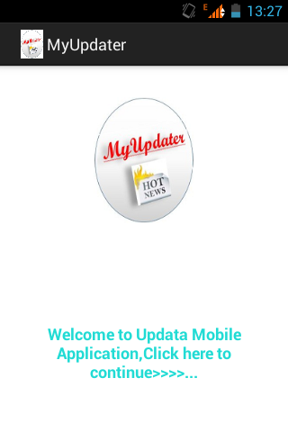

<<<<<<< HEAD
## Pitch: Mobile apps

## Java app projects

#### UpData mobile app - 2015/2016

Problem/Challenge identified: 
* Main Problem: Scattered information on opportunities, jobs, entertainment, politics, trends, etc. 
Lack of a local Applications to centralize data.
* Time(surfing the internet) and resources wastage(Data bundles while surfing).
* Difficulty in searching for needed information based on a specific preference due to scattered information.
* Outdated information which is irrelevant to the users.

Proposed solution: 
* Updata Android Application aims to centralize and organize all the relevant information in easily accessible manner on your android device.

<table>
  <tr>
    <td></td>
    <td></td>
    <td></td>
    <td></td>
  </tr>
 </table>

#### UpData mobile app - 2016

Problem/Challenge identified: 
* Main Problem: Lack of information real time tourism sector and cultural events in East African which widely attract tourists internationally and locally.
* The insecurity rise in the region causing a blow in the same sector
* Lack of trending information around you (opportunities, upcoming events, twitter handle feeds, Facebook feeds) 
* Emergence and continuous innovation of applications making it difficult to keep on all apps

Proposed solution: 
* MEFYND Android Application aims to find and advertise our diversity in Kenya and East Africa at large.
* Promote local tourism to as many mobile users as possible
* The MEFYND Application will be built on Android 2 and above

<table>
  <tr>
    <td></td>
    <td></td>
  </tr>
 </table>

 ###### Credits: 
 Kento for mentorship and guidance developing this application

